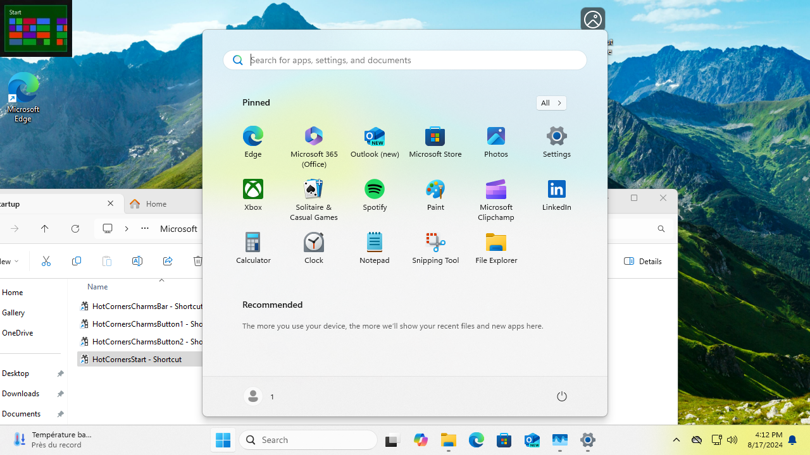

# Hot Corners

Display customizable buttons or bars when moving the mouse to the corners of the screen, inspired from Windows 8 way to access the `Start screen` and its `Charms bar`.

  
  

By default, the button is displayed in the top-left corner of the screen and a left-click will show `Start menu` while a right-click will act as `Show desktop` function.
Another alternative is to display a `Charms bar` from the bottom-right corner.
Touch screens are not yet supported.

## Installation

Download: see https://github.com/lebarsfa/HotCorners/releases.
Extract and copy the folder to e.g. `C:\Program Files\`.
Create shortcuts to all executables and place them in `C:\Users\YOUR USER NAME\AppData\Roaming\Microsoft\Windows\Start Menu\Programs\Startup`. This will make them run automatically after you restart.

## Rationale

The idea is that the default location of the `Show desktop` button on Windows 10-11 `Taskbar` is small and can be easily missed. In the same time, we may want to limit the number of fixed elements on the `Taskbar` and the `Start menu` button might be used to open a different menu than the default one (e.g. Open-Shell `Start menu`), or possibly we may want to fully hide the `Start menu` button while we still want to access the default `Start menu` and `Show desktop` functionalities.

[//]: # (
This is a multi-line comment.
You can write as many lines as you want in this comment.
Just make sure you keep everything within the parentheses.
Another alternative is to display a `Charms bar` with customizable buttons, which can be used to run different commands or shortcuts.
In the shortcut properties, you can add parameters to customize the buttons. You can create more shortcuts with different parameters to have different buttons.
)

## Developer information

Built with Visual Studio 2022 with "Desktop development with C++" workload. It is a C++ "Windows Desktop Application" project.
